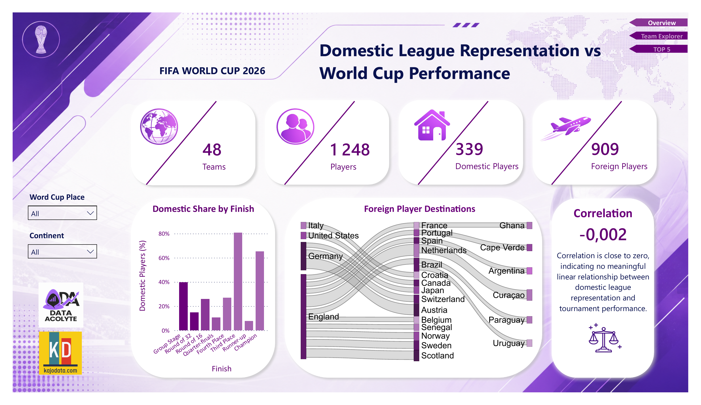
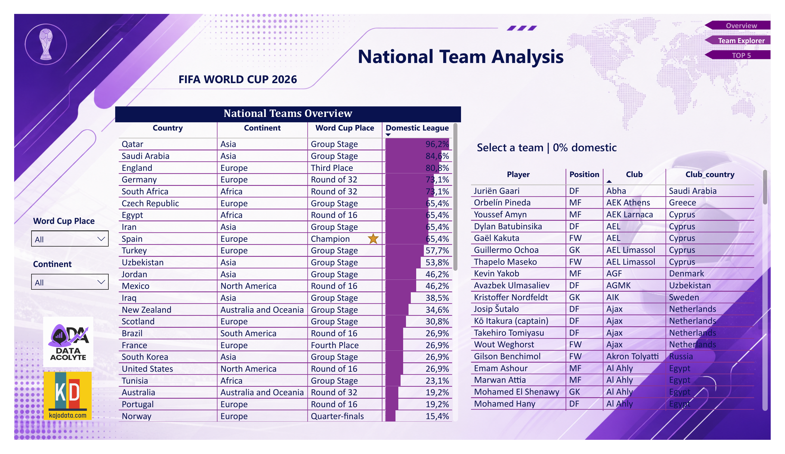
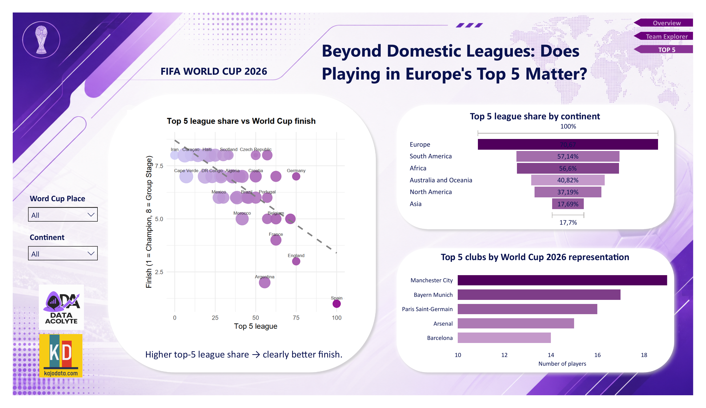

# FIFA World Cup 2026 Domestic League Representation

Analiza tego, czy odsetek zawodników grających w klubach z kraju, który reprezentują, oraz część
zawodników grających w klubach z top 5 lig europejskich (Premier League, La Liga, Bundesliga,
Serie A, Ligue 1) przekłada się na wynik reprezentacji na Mistrzostwach Świata 2026.

Projekt konkursowy: Data Acolyte x KajoDataSpace.

**Dashboard (Power BI):** 3 strony — Overview, Team Explorer, TOP 5.
**Post na LinkedIn:** [https://www.linkedin.com/feed/update/urn:li:activity:7486152453487443968/]

## Kluczowe wnioski

- **Odsetek zawodników w rodzimej lidze praktycznie nie koreluje z wynikiem w turnieju**
  (r = -0,002) - brak wykrywalnej zależności liniowej w tej próbie (48 drużyn).
- **Odsetek zawodników w top 5 lig europejskich koreluje znacznie wyraźniej z wynikiem** -
  reprezentacje z większym udziałem graczy z czołowych lig osiągały lepsze miejsca w turnieju.
- Wniosek: nie chodzi o to, *gdzie* zawodnik gra (kraj macierzysty czy zagranica), tylko o *jak
  mocna* jest liga, w której gra.

## Dashboard (Power BI)

**Overview**

KPI ogólne (48 drużyn, 1248 zawodników, 339/909 w rodzimej lidze/za granicą),
wykres udziału rodzimej ligi wg etapu turnieju, diagram Sankey przepływu zawodników między
krajem klubu a reprezentacją, karta ze współczynnikiem korelacji.

**Team Explorer**

Interaktywna tabela wszystkich 48 reprezentacji z wyszukiwarką i filtrami
(etap turnieju, kontynent), z panelem szczegółów (pełny skład + kluby) aktualizującym się po
kliknięciu wybranej drużyny.

**TOP 5**

Analiza drugiej hipotezy: wykres punktowy `Top5_Pct` vs `Finish` z linią trendu,
ranking top 5 klubów wg liczby reprezentantów na turnieju, `Top5_Pct` wg kontynentu.

## Źródła danych

Wszystkie dane zebrane samodzielnie, bez korzystania z gotowego datasetu. Dane pozyskano przy
pomocy scrapingu (R, pakiet `rvest`, Wikipedia API), a przy oczyszczaniu, łączeniu i weryfikacji
danych korzystano ze wsparcia modelu językowego Claude Sonnet 5 (Anthropic).

| Dane | Źródło | Sposób pozyskania |
|---|---|---|
| Składy 48 reprezentacji (zawodnik, pozycja, klub, liczba meczów/goli) | [Wikipedia - 2026 FIFA World Cup squads](https://en.wikipedia.org/wiki/2026_FIFA_World_Cup_squads) | Web scraping (R, pakiet `rvest`) |
| Kraj przynależności klubu | Infoboxy stron klubów na Wikipedii | Wikipedia API (`action=parse`), pole `Country`/`Ground`/`League` z infoboxu |
| Wynik reprezentacji w turnieju | SofaScore | Uzupełnione ręcznie na podstawie wyników turnieju |

## Metodologia

1. **Pobranie składów** - dla każdej z 48 reprezentacji wyciągnięto tabelę składu (numer, pozycja,
   zawodnik, data urodzenia, liczba meczów/goli, klub) ze strony zbiorczej Wikipedii.
2. **Ustalenie kraju klubu** - dla każdego unikalnego klubu (451 klubów) automatycznie pobrano
   kandydata na kraj z infoboxu strony klubu na Wikipedii, a następnie **ręcznie zweryfikowano
   i poprawiono** wszystkie wartości w arkuszu kalkulacyjnym (automatyczne odczyty z pól typu
   "Ground"/"League" bywały niejednoznaczne - np. nazwa stadionu lub ligi zamiast kraju).
3. **Wskaźnik "gra w rodzimej lidze"** - zawodnik oznaczony jako grający w rodzimej lidze, jeśli
   kraj jego klubu jest tym samym krajem, który reprezentuje na MŚ 2026.
4. **Agregacja per drużyna** - policzono odsetek zawodników grających w rodzimej lidze dla każdej
   z 48 reprezentacji i zestawiono z osiągniętym wynikiem w turnieju.
5. **Oczyszczanie i weryfikacja** - model językowy Claude Sonnet 5 wspierał proces przy naprawie
   uszkodzonego kodowania znaków w pliku ze słownikiem klub→kraj, zbudowaniu słownika tłumaczącego
   polskie nazwy krajów na angielskie (do zgodności z nazwami reprezentacji), oraz weryfikacji
   kompletności połączenia między tabelami (brakujące dopasowania klubów).

## Ograniczenia i założenia

- **"Gra w rodzimej lidze" ≠ "gra w słabszej lidze"**. Wskaźnik nie uwzględnia siły/poziomu ligi
  krajowej - wysoki odsetek dla reprezentacji z mocną ligą krajową (np. Anglia, Premier League)
  znaczy co innego niż wysoki odsetek dla reprezentacji z niszową ligą krajową (np. Katar). Wynik
  należy interpretować z tym zastrzeżeniem, nie jako prostą przyczynowość.
- Kraj klubu ustalany był na dzień zbierania danych (lipiec 2026) - ewentualne transfery w trakcie
  lub tuż przed turniejem mogły nie zostać uwzględnione.
- Dla 5 reprezentacji (m.in. Senegal, Wybrzeże Kości Słoniowej, Demokratyczna Republika Konga,
  Republika Zielonego Przylądka, Urugwaj) żaden zawodnik w kadrze nie grał w klubie z kraju, który
  reprezentuje - 0% nie jest błędem danych, tylko odzwierciedla faktyczny brak silnej ligi krajowej
  / model eksportu talentu tych federacji.

## Druga hipoteza: top 5 lig europejskich

Oprócz wskaźnika "gra w rodzimej lidze" policzono analogiczny wskaźnik `Top5_Pct` — odsetek
zawodników danej reprezentacji grających w klubie z Anglii, Hiszpanii, Niemiec, Włoch lub Francji
(niezależnie od tego, czy to kraj macierzysty zawodnika). Policzony w Power BI jako kolumna DAX na
podstawie `Club_country`, zagregowana per drużyna i zestawiona z `Finish` (numeryczna reprezentacja
wyniku turnieju: 1 = Champion, 8 = Group Stage) tym samym sposobem co wskaźnik rodzimej ligi.

**Ograniczenie metodologiczne**: to przybliżenie po kraju klubu, nie po faktycznej nazwie ligi -
zawodnik w niższej lidze angielskiej (np. League One) liczy się tak samo jak gracz Manchesteru
City. Świadome uproszczenie, analogiczne do wskaźnika rodzimej ligi.

## Narzędzia

R (`rvest`, `dplyr`, `httr`, `janitor`, `stringr`) — scraping i przygotowanie danych.
Power BI (Power Query, DAX) — model danych, wskaźniki, wizualizacja.
Excel — ręczna korekta słownika klub→kraj.
